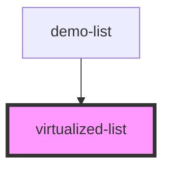

# virtualized-list

<!-- Auto Generated Below -->

## Properties

| Property    | Attribute | Description | Type                         | Default     |
| ----------- | --------- | ----------- | ---------------------------- | ----------- |
| `items`     | --        |             | `any[]`                      | `[]`        |
| `renderRow` | --        |             | `(item: any) => HTMLElement` | `undefined` |

## Dependencies

### Used by

 - [demo-list](../demo-list)

### Graph

----------------------------------------------

*Built with [StencilJS](https://stenciljs.com/)*
